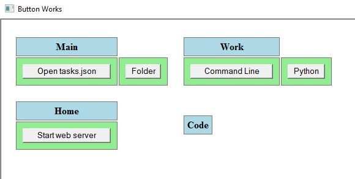

# ButtonWorks
A simple button based dashboard maker for launching various applications.

The dashboard consists of various groups like Main, Work etc. In each group we can show buttons that launch tasks when clicked.

This dashboard with buttons can be made entirely in json. The library is implemented in src/libButtonWorks.js. It depends on json2.js(https://github.com/douglascrockford/JSON-js) to read json data. To use the library make a file like src/tasks.json and a HTML based application or page like src/menu.hta. The HTML should have a table with an unique id e.g. id="mainLayout". Then call loadTasks("tasks.json")

This library will then create tables inside the specified in your HTML, corresponding to the specified groups. Buttons will be created inside the tables corresponding to the tasks specified for each group.

The JSON format is as follows:
The "settings" object currently has just one field "mainLayoutName" that should be set to the name of the HTML table under which the entire dashboard will be created.

The "layout" array is for laying out the groups in the window in a box or grid layout. It consists of multiple arrays with each array representing one row in the dashboard.
So a row like `["Main", "Work"]` will show the Main and Work groups in the same row.
The positions of the groups can be changed by changing the JSON instead of editing HTML.

Each mentioned group in the "layout" array should appear in the "groups" object once. Here we declare the tasks in each group. Tasks are again laid out in a grid layout using HTML tables. So each group is an array of arrays again with each row in the  declaring the tasks to be shown in that row. The tasks are referenced using the task ids which are just numbers.

The actual tasks are in the "tasks" object. The key for each child object is the id of the task. Tasks can be of various types like "start", "explorer", "bat", "cmd" and "py".

